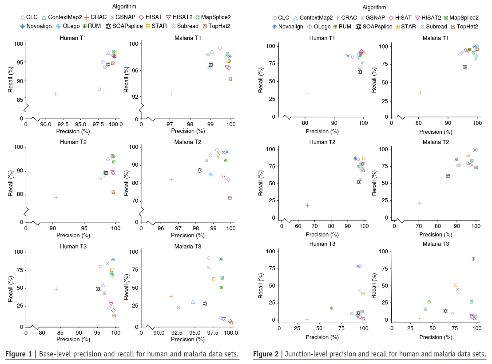
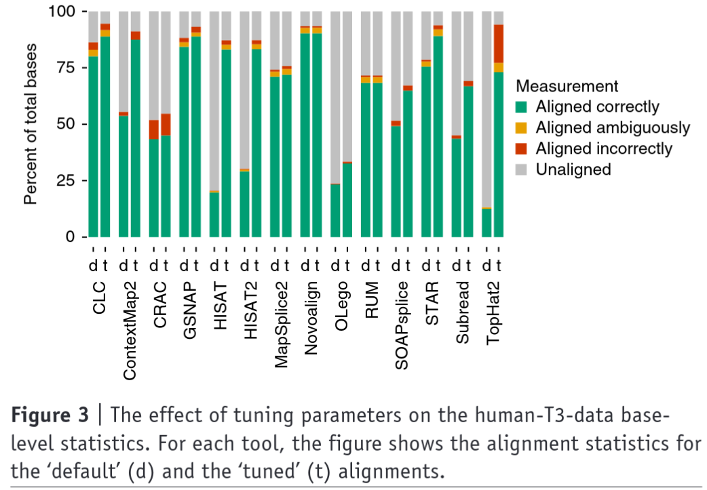

# Simulation-based comprehensive benchmarking of RNA-seq aligners

Baruzzo et al., 2017. Nat. Method.

### Motivation

- RNA-seq aligners are widely used, but their performance varies across datasets.

- Existing benchmarks are often, limited in scope, inconsistent in conclusion

- Need systematic and controlled *Evaluation* across different organisms and error condition

  *"To provide a comprehensive evaluation and realistic benchmarking framework for RNA-seq aligners using controlled simulations that mimic different biological and technical conditions."*

### Approach

- Simulated Read from two species with different genome complexity, indicate error or variants (low, mod, and high - T1, T2, T3)
- Benchmarking 14 splice-aware aligner for both simulated data and real data
- Evaluating on base-level, read-level and junction-level
- Detecting splice junction and quantifying mapping rate

### Results

### Main claims

1. Performance is condition-dependent; error rate, organism complexity, read characteristics
2. no universal best aligner
3. parameter setting is core key, but hard to do for real data

### Limitations and/ or Insight

1. if the reasons why the performance still unknown, simulation is tend to not same as reality
2. user-relevant - method-relevant
3. alignment quality is a binary-wise or continuum-wise

### Conclusion

Alignment performance is context-dependent, and careful benchmarking is required to choose the appropriate tool (method-relevant)

#### Gap.

*"Why does performance change? and what exactly is being measure?"*