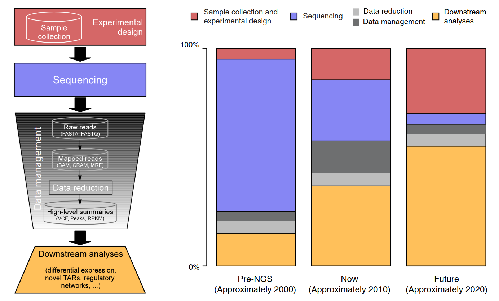

# illumina RNA-Seq Data Processing

take it home with you-ah!

"If the data scientist has done their job correctly the *statistical models* don't need to complicated to identify important relationships, *In fact, if a complicated statistical model seems necessary, it often means that you don't have the right data to answer the question!*"

- ### the real cost of sequencing

  Sboner A, Mu XJ, Greenbaum D, Auerbach RK, Gerstein MB. The real cost of sequencing: higher than you think! Genome Biol. 2011 Aug 25;12(8):125. doi: 10.1186/gb-2011-12-8-125. PMID: 21867570; PMCID: PMC3245608.

  

This course was more likely to learn about downstream analysis AND YES IT'S VERY EXPENSIVE. 

- ### CLI

  Learn about 'bashing' using a course from korf's lab or viki's repo both are ok!, I know its alot and takes time, trust me the key is "CONSISTENT AND KEEP TRYING - NEVER STOP"

- ### Data (/data)

  Understand the data that you want to work with. In this time you gonna work with this type file *fasta (.fa), fastq (.fastq or .fastq.gz), gtf/gff, sam/bam/cram. Since we will be working with rnaseq type data so mainly the data will be two part first */data/raw* contain .fa .fastq.gz or bam/sam/cram. second */data/ref contain all information of your reference genome.

